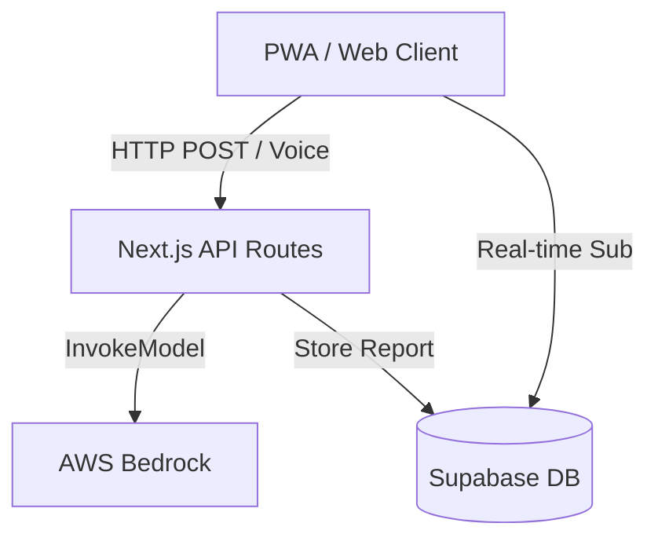

# How to Create PowerPoint from SAAAF_Presentation.md

## Method 1: Using Pandoc (Recommended - Automated)

### Install Pandoc
```bash
# Ubuntu/Debian
sudo apt-get install pandoc

# macOS
brew install pandoc

# Windows
# Download from: https://pandoc.org/installing.html
```

### Convert to PowerPoint
```bash
pandoc SAAAF_Presentation.md -o SAAAF_Presentation.pptx
```

### With Custom Theme
```bash
pandoc SAAAF_Presentation.md -o SAAAF_Presentation.pptx --reference-doc=template.pptx
```

## Method 2: Manual Copy-Paste (Quick & Easy)

1. Open PowerPoint
2. Create a new presentation
3. Choose a professional theme (recommended: "Ion" or "Facet")
4. Copy content from `SAAAF_Presentation.md` slide by slide
5. Add visuals and formatting

## Method 3: Using Online Tools

### Option A: Slides.com
1. Go to https://slides.com
2. Import markdown or paste content
3. Export as PowerPoint

### Option B: Google Slides
1. Create new Google Slides presentation
2. Copy content from markdown
3. Download as PowerPoint (.pptx)

## Recommended Design Elements

### Color Scheme (Civic Shield Theme)
- **Primary:** Saffron (#FF9933)
- **Secondary:** Green (#138808)
- **Background:** Navy Blue (#0F172A)
- **Text:** White (#FFFFFF)

### Fonts
- **Headings:** Outfit (Bold)
- **Body:** Inter (Regular)

### Icons & Images
- Use icons for features (📸 🎙️ 📍 🛡️ 👮)
- Add screenshots from your demo
- Include architecture diagram
- Add map visualization examples

## Slide Layout Suggestions

### Slide 1 (Title)
- Large title with logo
- Subtitle with tagline
- Background: Gradient (Saffron to Navy)

### Slide 2 (Problem)
- 4 boxes with icons
- Each box = one problem
- Use red/orange colors for emphasis

### Slide 3 (Solution)
- 5 feature cards
- Icons for each feature
- Brief description under each

### Slide 4 (Tech Stack)
- Architecture diagram (use draw.io or Mermaid)
- Logo icons for each technology
- Flow arrows showing data movement

### Slide 5 (Impact)
- Split layout: Citizens | Government
- Use statistics with large numbers
- Add checkmarks for benefits

### Slide 6 (Future)
- 4 cards in grid layout
- Icon for each future feature
- Timeline (optional)

### Slide 7 (Thank You)
- Large "Thank You" text
- QR code to GitHub repo
- Contact information

## Adding Visuals

### Screenshots to Include
1. Home page with report feed
2. Map view with markers
3. Voice input interface
4. Mobile responsive view
5. Official dashboard

### Where to Get Icons
- https://fontawesome.com
- https://heroicons.com
- https://icons8.com

### Architecture Diagram
Use the Mermaid diagram from `design.md`:


Convert to image using:
- https://mermaid.live
- Or include in PowerPoint using Mermaid plugin

## Final Touches

### Before Exporting
- [ ] Check all slides for typos
- [ ] Ensure consistent formatting
- [ ] Add slide numbers
- [ ] Include footer with project name
- [ ] Test animations (if any)
- [ ] Export as PDF for submission

### Export Settings
- **Format:** PowerPoint (.pptx) and PDF
- **Quality:** High resolution
- **Fonts:** Embed fonts for compatibility

## Quick Command Summary

```bash
# Convert markdown to PowerPoint
pandoc SAAAF_Presentation.md -o SAAAF_Presentation.pptx

# Convert to PDF (for submission)
pandoc SAAAF_Presentation.md -o SAAAF_Presentation.pdf

# With custom template
pandoc SAAAF_Presentation.md -o SAAAF_Presentation.pptx --reference-doc=template.pptx
```

## Need Help?

If you encounter issues:
1. Check Pandoc documentation: https://pandoc.org/MANUAL.html
2. Use online converters as backup
3. Manual creation in PowerPoint is always reliable

---

**Pro Tip:** Keep the presentation concise (7-10 slides max) and focus on visuals over text!
