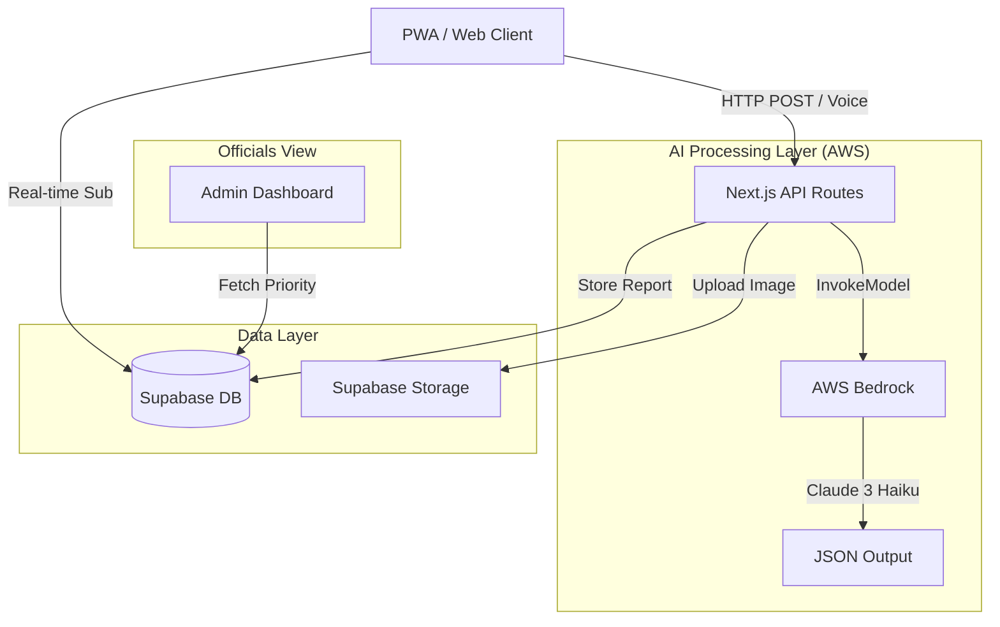

# SAAAF - System Design Document

> Generated for AI For Bharat Hackathon 2026

## 1. High-Level Architecture

SAAAF follows a **Serverless, Event-Driven Architecture** utilizing Next.js for the full stack, AWS Bedrock for intelligence, and Supabase for state management.

## 2. Component Design

### 2.1 Frontend (Next.js 14 App Router)
- **Framework:** React 19, Tailwind CSS v4.
- **Key Components:**
    - `ReportForm`: Handles image compression and submission.
    - `MapView`: Renders Leaflet map with clustering.
    - `VoiceInput`: Uses Web Speech API for Hindi/English input.
    - `ReportCard`: Displays individual report with severity badge.

### 2.2 Backend (Server Actions)
- **`analyzeImageAction`**:
    1. Receives `FormData`.
    2. Converts Image to Base64.
    3. Calls `bedrock-runtime` client.
    4. Parses JSON response from Claude 3.
- **`submitReportAction`**:
    1. Validates input.
    2. Uploads image to Supabase Bucket `evidence`.
    3. Inserts record into `reports` table.

### 2.3 Database Schema (PostgreSQL)

**Table: `reports`**
| Column | Type | Description |
|---|---|---|
| `id` | UUID | Primary Key |
| `title` | TEXT | Auto-generated title |
| `description` | TEXT | Analysis result |
| `category` | TEXT | Fire, Pothole, etc. |
| `severity_score` | INT | 1-10 scale |
| `latitude` | FLOAT | Geo-location |
| `longitude` | FLOAT | Geo-location |
| `image_url` | TEXT | Link to evidence |
| `status` | ENUM | open, in_progress, resolved |
| `user_id` | UUID | FK to users |
| `created_at` | TIMESTAMPTZ | Creation time |

**Table: `users`**
| Column | Type | Description |
|---|---|---|
| `id` | UUID | Auth ID |
| `karma_points` | INT | Gamification score |
| `role` | ENUM | citizen, official |

### 2.4 AI Model Configuration
- **Provider:** AWS Bedrock
- **Model ID:** `anthropic.claude-3-haiku-20240307-v1:0`
- **Parameters:**
    - `max_tokens`: 1024
    - `temperature`: 0.1 (Deterministic for classification)
    - `system_prompt`: "You are a civic safety expert..."

## 3. UI/UX Design System
- **Theme:** "Civic Shield"
- **Palette:**
    - Primary: Saffron (`#FF9933`)
    - Secondary: Green (`#138808`)
    - Background: Navy Blue (`#0F172A`)
- **Typography:** Inter (UI), Outfit (Headings).
- **Accessibility:** High contrast ratios, ARIA labels for voice interactions.

## 4. Security Design
- **Authentication:** Supabase Auth (JWT).
- **Row Level Security (RLS):**
    - `reports`: Public Read, Authenticated Insert.
    - `profiles`: Self Update only.
- **API Security:** AWS Credentials never exposed to client (Server Actions only).

---
*Note: This document fulfills the hackathon requirement for `design.md`.*
